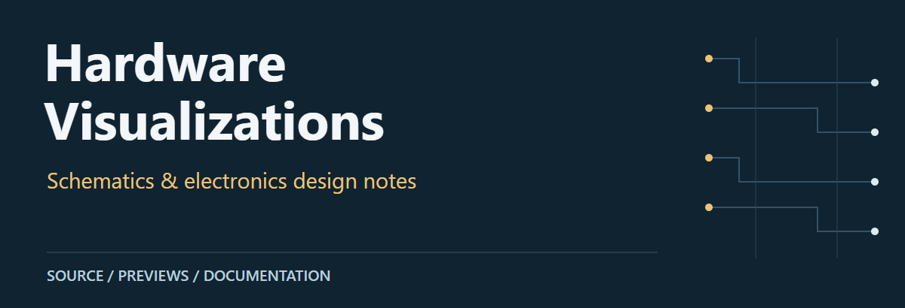
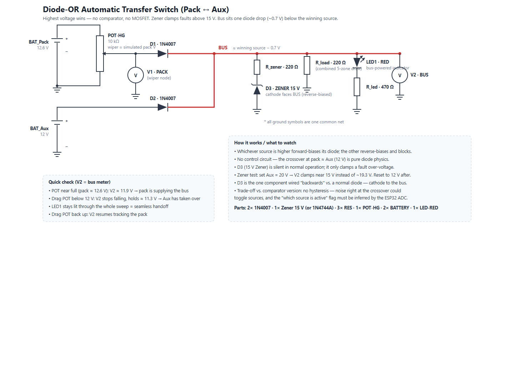
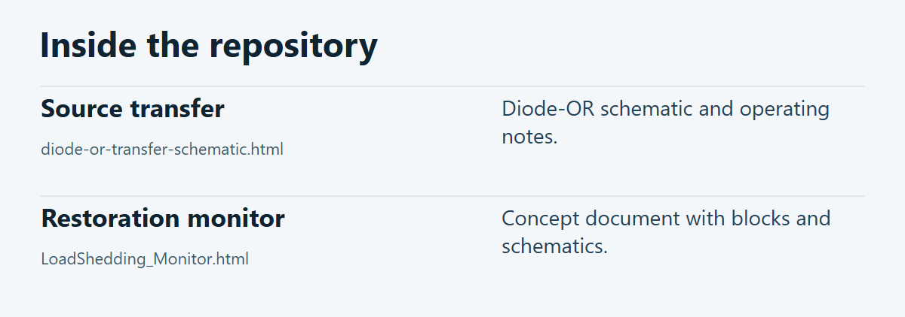

# Hardware Visualizations

Browser-readable electronics documents: a diode-OR source-transfer schematic and a load-shedding monitor concept.

**[Source guide](#source-guide)** · **[Getting started](#getting-started)** · **[Scope & limitations](#scope--limitations)**

## Preview

[](docs/visuals/transfer-preview.png)

Browser-rendered diode-OR design document. Values shown are design annotations, not measurements.

## Source guide

[](docs/visuals/repository-guide.png)

| Component | Open source | Purpose |
| :-- | :-- | :-- |
| Source transfer | [`diode-or-transfer-schematic.html`](diode-or-transfer-schematic.html) | Diode-OR schematic and operating notes. |
| Restoration monitor | [`LoadShedding_Monitor.html`](LoadShedding_Monitor.html) | Concept document with blocks and schematics. |

## Getting started

From a local checkout of this repository:

```bash
python -m http.server 8000
```

## Scope & limitations

Open the HTML files from http://localhost:8000/. These are design documents, not a certified mains-ready product. Mains circuits require isolation, protection and qualified review; proposal claims have not been revalidated here.

---

[Visual asset sources and presentation notes](docs/visuals/README.md)
